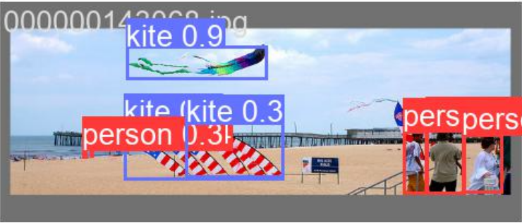

# Multi object detection using Yolov5n model

For more information, look at [this](https://pytorch.org/hub/ultralytics_yolov5/) post.

PyTorch implementation of an Multi object detection model. This repository contains all code for predicting/detecting and evaulating the model.

This repository combines elements from:
* https://github.com/ultralytics/ultralytics/tree/main/ultralytics
* https://docs.ultralytics.com/modes/train/




## Installation

To install all required libaries:
```
pip install -r requirements.txt
```

## Predictions

Experimental results, predictions, weights and configs are available at: https://drive.google.com/drive/folders/1Ce-fRgYe6nOAFm_hL_qSOwR3bRdh_1L9. 


### Run predictions

To run predictions:
* Upload test images in the 'test_images' folder
* Change the predict.py file according to the model that you want to use
* customize the prediction parameters like IOU threshold, confidence parameters according to the user's requirement
* run the file using command: python predict.py

For more information checkout this page: [link](https://docs.ultralytics.com/modes/predict/) 


## Test

For testing download data from: [https://drive.google.com/drive/folders/1fnnt_dNrwajUbuxo7xra_ejtO8r94-Jy](https://drive.google.com/drive/folders/1fnnt_dNrwajUbuxo7xra_ejtO8r94-Jy)


To run test execute the following code:

```
python <model>.py
```

Different number of experiments were conducted. Test results are as follows:

| Experiments                     | BoxLoss| Cls   | mAP@50| mAP@50-95|
|---------------------------------|------- |-------|-------|----------|
| Vanilla YOLO                    | 1.359  | 1.916 | 0.386 | 0.256    |
| Small Anchor                    | 1.264  | 1.536 | 0.427 | 0.289    |
| Skip Connections                | 1.268  | 1.627 | 0.419 | 0.282    |
| Inception                       | 1.338  | 1.801 | 0.406 | 0.273    |
| Small Anchor + Skip Conncection | 1.297  | 1.853 | 0.411 | 0.276    |
| Skip Connection + Inception     | 1.348  | 1.813 | 0.401 | 0.266    |
| Small Anchor + Inception        | 1.305  | 1.876 | 0.408 | 0.276    |
